# pfsense-vlan-lab

This is my home lab where I use pfSense to split one network into three zones with VLANs: TRUSTED, IOT and GUEST. Every zone has its own subnet, its own DHCP and its own firewall rules. The goal was to learn how network segmentation works in practice, not only in the slides from class.

An earlier version also had a physical ASUS access point and WireGuard for remote access (see the notes in `notes/`). This README goes through the setup in VMware Workstation step by step, with screenshots of every step, and explains why I did things the way I did.

## Contents

- [Why split a network at all](#why-split-a-network-at-all)
- [What I used](#what-i-used)
- [Network plan](#network-plan)
- [Who can talk to who](#who-can-talk-to-who)
- [Step 1: VMware network](#step-1-vmware-network)
- [Step 2: Install pfSense](#step-2-install-pfsense)
- [Step 3: Setup wizard](#step-3-setup-wizard)
- [Step 4: Make the VLANs](#step-4-make-the-vlans)
- [Step 5: DHCP for each zone](#step-5-dhcp-for-each-zone)
- [Step 6: VLAN interfaces in Kali](#step-6-vlan-interfaces-in-kali)
- [Step 7: Default deny before any rules](#step-7-default-deny-before-any-rules)
- [Step 8: Alias for private networks](#step-8-alias-for-private-networks)
- [Step 9: Firewall rules](#step-9-firewall-rules)
- [Step 10: Testing the rules](#step-10-testing-the-rules)
- [Problems I hit](#problems-i-hit)
- [What I learned](#what-i-learned)
- [Not in this version](#not-in-this-version)

## Why split a network at all

In a normal home network everything is on the same flat network. The work laptop, the phone, the smart TV, the cheap smart bulb and the friend's phone can all see each other. If one device gets hacked, the attacker can easily scan and attack everything else from there.

Smart devices are often the weakest part. They get few updates, they often have old software, and you cannot install antivirus on them. A guest phone is also something you have no control over.

The idea with segmentation is simple: put devices in groups (zones) based on how much you trust them, and only allow the traffic that each group really needs. If something in the IOT zone gets hacked, it should not be able to reach my own PC.

This is the same basic idea as "zones and conduits" in the IEC 62443 standard for industrial networks, where control systems are put in zones and the traffic between zones only goes through controlled connections. My lab is much smaller, but the thinking is the same.

## What I used

| Part | What | Why |
|------|------|-----|
| Hypervisor | VMware Workstation Pro on Windows 11 | Free for personal use, and LAN segments make it easy to make an isolated switch |
| Firewall | pfSense CE 2.9.0 (Netgate Installer) | Free, used a lot in the real world, and has a good web interface |
| Test client | Kali Linux 2025.2 | Has nmap, tcpdump and curl built in, and can make VLAN interfaces |
| Virtual switch | VMware LAN segment `lab-trunk` | Works like a switch port that carries tagged VLANs |

## Network plan

| VLAN | Name    | Subnet        | Gateway    | DHCP range                | What it is for              |
|------|---------|---------------|------------|---------------------------|-----------------------------|
| -    | WAN     | 192.168.170.0/24 (VMware NAT) | 192.168.170.2 | from VMware | Internet for pfSense |
| -    | LAN     | 192.168.1.0/24 | 192.168.1.1 | 192.168.1.100-199        | Only used for setup         |
| 10   | TRUSTED | 10.10.10.0/24 | 10.10.10.1 | 10.10.10.100-200          | My own PCs and phone        |
| 20   | IOT     | 10.10.20.0/24 | 10.10.20.1 | 10.10.20.100-200          | Smart devices               |
| 30   | GUEST   | 10.10.30.0/24 | 10.10.30.1 | 10.10.30.100-150          | Guests                      |

I picked the third number in the IP address to match the VLAN number (VLAN 20 = 10.10.**20**.x). It makes it much easier to see which zone an address belongs to when you read logs.


All three VLANs go over the same virtual cable (em1). This is called a trunk. Every packet gets a small 802.1Q tag with the VLAN number, so pfSense knows which zone the packet came from, even if it is the same cable. Kali makes one virtual interface per VLAN, so one VM can act like a device in each zone.

## Who can talk to who

This is the plan I wanted the firewall rules to follow:

| From \ To | TRUSTED | IOT | GUEST | pfSense (DNS) | Internet |
|-----------|---------|-----|-------|---------------|----------|
| TRUSTED   | -       | allowed | blocked | allowed | allowed |
| IOT       | blocked | -       | blocked | allowed | only HTTPS (443) and NTP (123) |
| GUEST     | blocked | blocked | -       | allowed | allowed |

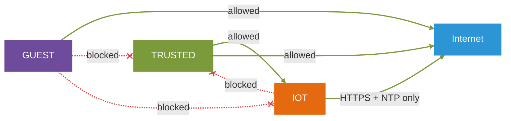

TRUSTED is allowed to start connections to IOT, because I want to control smart devices from my PC or phone. But IOT is not allowed to start connections back to TRUSTED. This works because pfSense is a stateful firewall. When TRUSTED opens a connection to IOT, pfSense remembers it and lets the answers come back, without me making a rule for the other direction.

## Step 1: VMware network

The pfSense VM has two network adapters:

- Adapter 1: NAT. This becomes WAN and gives pfSense internet through my Windows PC.
- Adapter 2: LAN segment `lab-trunk`. This becomes LAN, and all the VLANs run on top of it.

A LAN segment in VMware is like a private switch that only the VMs you connect to it can see. The Windows host is not on it, so nothing can sneak around pfSense.

I made a new LAN segment called `lab-trunk` under "LAN Segments...". The Kali VM only has one adapter, and it is also on `lab-trunk`. It is important that Kali does not have a NAT adapter too, because then traffic could go around pfSense and the tests would not prove anything.

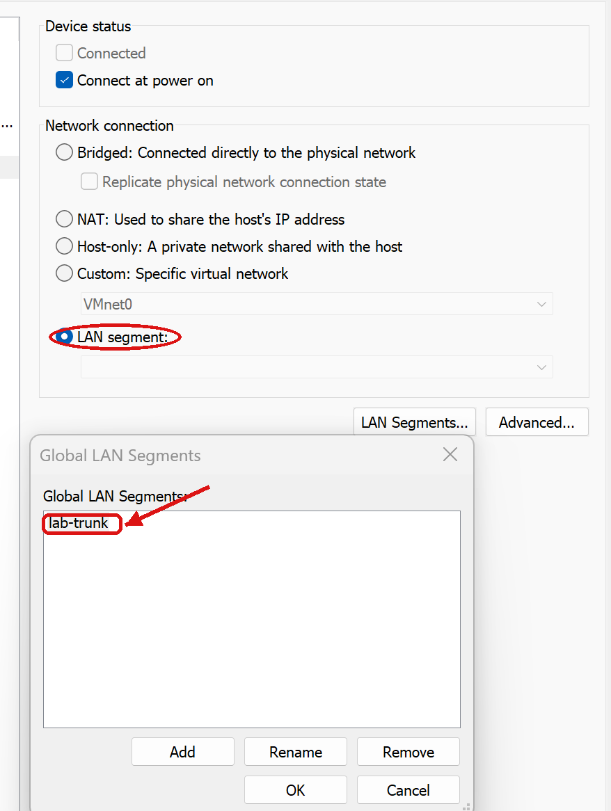

I gave the pfSense VM 2 GB RAM and a 20 GB disk. Earlier I used 1 GB and it got slow when there were many clients (see `notes/feilsøking.md`).

## Step 2: Install pfSense

Netgate now gives out pfSense through the "Netgate Installer". It is free, but you need to make an account in the Netgate store and "buy" it for 0 kr to get the download link.

I booted the installer ISO and chose:

| Question in installer | What I chose | Why |
|-----------------------|--------------|-----|
| WAN interface | em0, DHCP | em0 is the first adapter (NAT). I checked the MAC address in VMware to be sure. |
| LAN interface | em1, 192.168.1.1/24 with DHCP | This is only a setup network. The real zones come later as VLANs. |
| Edition | Install CE | CE is the free Community Edition. Plus needs a subscription. |
| Version | 2.9.0 | The newest stable version |
| Disk | ZFS, stripe, one disk | Default choice, and there is only one virtual disk |

The installer downloads packages from the internet while it runs, so WAN must work before you can install. After it was done I rebooted and removed the ISO, so the VM did not start the installer again.

After the reboot I opened Firefox in Kali and went to `https://192.168.1.1`. Kali got 192.168.1.100 from the LAN DHCP. The certificate is self signed, so Firefox gives a warning that you have to accept. The setup wizard starts, and pfSense warns that the admin password is still the default one. I changed it later in the wizard.

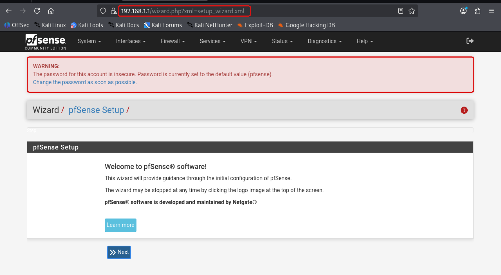

## Step 3: Setup wizard

In General Information I set:

- Hostname: `pfSense`
- Domain: `home.arpa`
- Primary DNS: `1.1.1.1` (Cloudflare)
- Secondary DNS: `9.9.9.9` (Quad9)

I used `home.arpa` because pfSense says not to use `.local`. The `.local` ending is used by mDNS (Bonjour, AirPrint and so on), and then some devices will not work right. `home.arpa` is made for home networks.

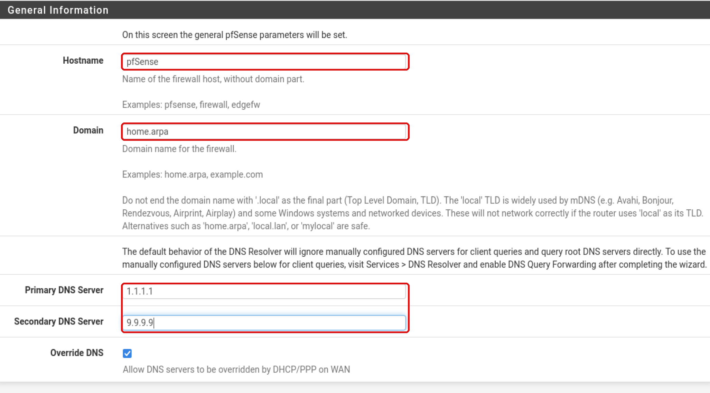

Time zone is Europe/Oslo, so the times in the logs match my clock.

On the WAN page there is a setting called "Block RFC1918 Private Networks" that is on by default. It blocks traffic coming in on WAN from private addresses like 192.168.x.x. I removed the tick, because my WAN address is itself a private address from VMware NAT (192.168.170.199). In a real home network with a real public IP you should keep it on. "Block bogon networks" I kept on.

Then I set a new admin password and finished the wizard.

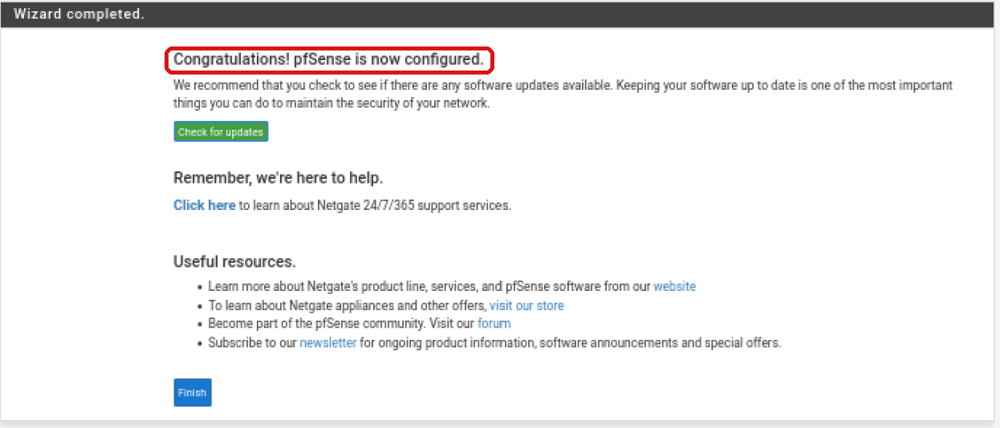

The dashboard shows three things I wanted to check:

- System: it runs as a VMware Virtual Machine
- Version: 2.9.0-RELEASE
- Interfaces: WAN has 192.168.170.199 from VMware, and LAN has 192.168.1.1. Both have a green arrow, so they are up.

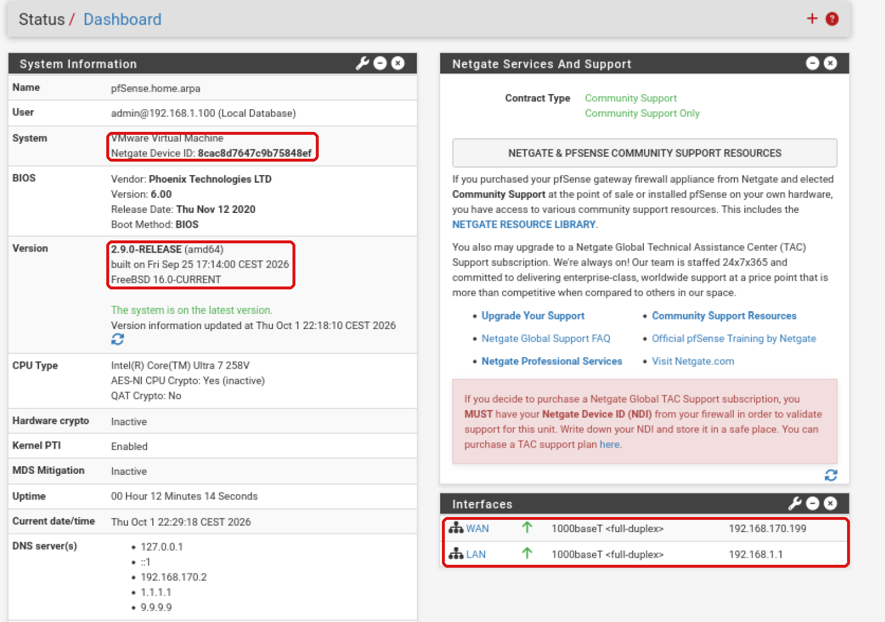

## Step 4: Make the VLANs

Under Interfaces > Assignments > VLANs I made three VLANs. They all use em1 as the parent interface, because em1 is the trunk.

| Parent | VLAN tag | Description |
|--------|----------|-------------|
| em1 | 10 | TRUSTED |
| em1 | 20 | IOT |
| em1 | 30 | GUEST |

VLAN Tag Type is C-Tag (0x8100), which is normal 802.1Q. VLAN Priority I left empty. It is for QoS and I do not need it here.

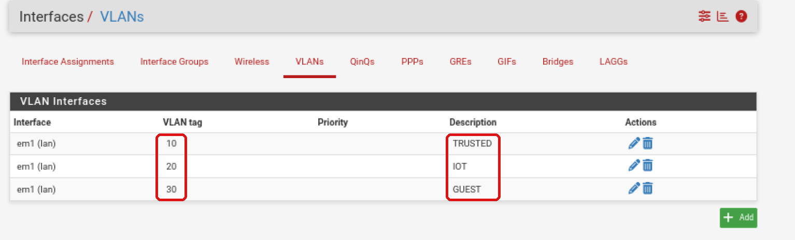

Making a VLAN does not do anything by itself. It only tells pfSense that tagged traffic can come in on em1. To use it, the VLAN must become an interface. Under Interface Assignments I picked each VLAN in the list "Available network ports" and pressed Add. pfSense calls them OPT1, OPT2 and OPT3 first.

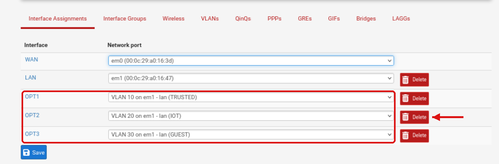

I clicked on each OPT interface and set:

| Setting | Value | Why |
|---------|-------|-----|
| Enable interface | on | Interfaces are off when you add them |
| Description | TRUSTED / IOT / GUEST | This name is used everywhere in the GUI, in rules and in logs |
| IPv4 Configuration Type | Static IPv4 | pfSense is the gateway, so it needs a fixed address |
| IPv6 Configuration Type | None | I only use IPv4 in this lab |
| IPv4 Address | 10.10.10.1 / 24 (and .20.1, .30.1) | Gateway address for the zone |
| IPv4 Upstream gateway | None | This is an inside network, not a way to the internet |

You have to choose /24 in the small box next to the address. If you forget, it can stay at /32, and then the interface thinks the network is only one address and nothing works. And if you choose an upstream gateway here, pfSense starts to treat the interface like a WAN, which you do not want.

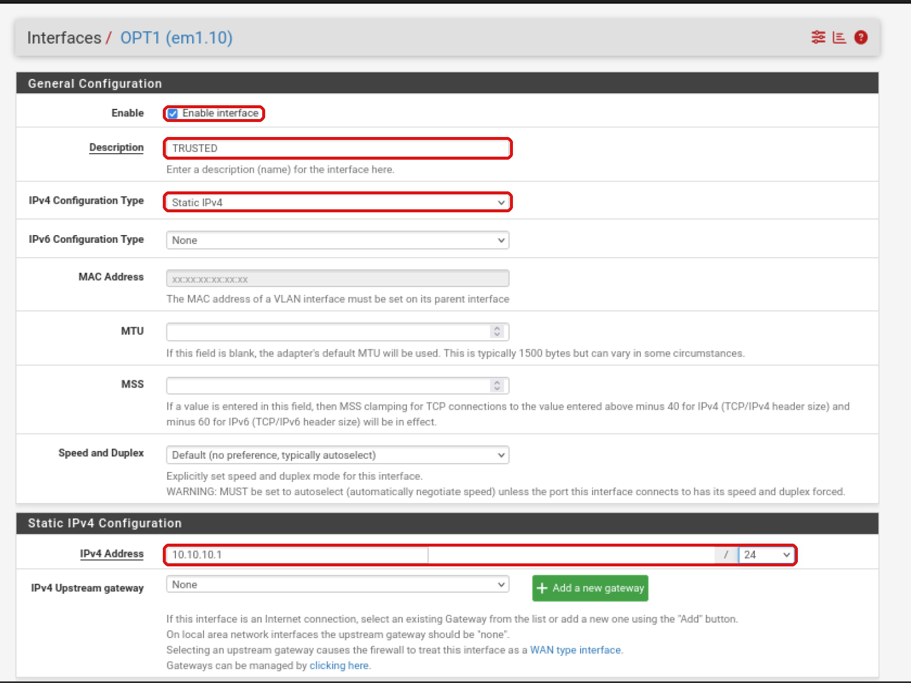

After Save and Apply Changes the interfaces have real names:

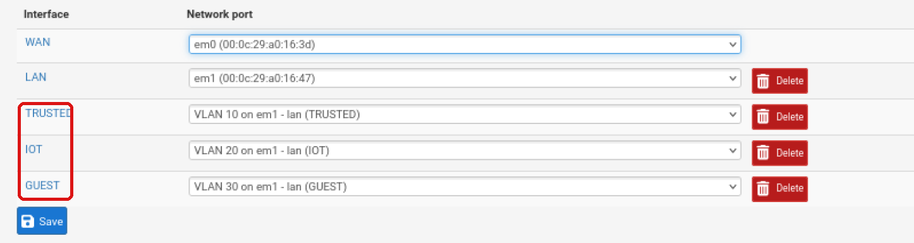

## Step 5: DHCP for each zone

Under Services > DHCP Server every zone has its own tab. On each tab I turned on "Enable DHCP server" and set the address pool:

| Zone | Pool |
|------|------|
| TRUSTED | 10.10.10.100 - 10.10.10.200 |
| IOT | 10.10.20.100 - 10.10.20.200 |
| GUEST | 10.10.30.100 - 10.10.30.150 |

I started the pools at .100 so .2 to .99 are free for devices with a static IP later, like a printer or a server. GUEST gets a smaller pool because there are never many guests at the same time.

I left the DNS fields empty. Then pfSense gives out its own address in each zone as DNS server (for example 10.10.20.1 in IOT). This way all DNS goes through pfSense, and later I can add DNS filtering in one place.

When I started, pfSense 2.9.0 used the old ISC DHCP server and showed a warning that ISC is end of life. In the end I changed to Kea under System > Advanced > Networking > DHCP Backend. The settings on each tab stayed the same. More about this in "Problems I hit".

## Step 6: VLAN interfaces in Kali

Kali only has one network card (eth0), but it is connected to the trunk. To act like a device in each zone, I made one VLAN interface per zone with NetworkManager:

```
sudo nmcli con add type vlan con-name vlan10 dev eth0 id 10 ifname eth0.10
sudo nmcli con add type vlan con-name vlan20 dev eth0 id 20 ifname eth0.20
sudo nmcli con add type vlan con-name vlan30 dev eth0 id 30 ifname eth0.30
```

| Part | Meaning |
|------|---------|
| `type vlan` | Make a VLAN interface |
| `con-name vlan10` | Name of the connection in NetworkManager |
| `dev eth0` | The real network card the VLAN runs on |
| `id 10` | VLAN tag that is put on every packet |
| `ifname eth0.10` | Name of the new interface in Linux |

Everything Kali sends out on eth0.10 gets tag 10, and pfSense sees it as TRUSTED traffic. NetworkManager asks for an address with DHCP on each one automatically. You can check with `ip -br a`. When DHCP finally worked, Kali got one address in each zone:

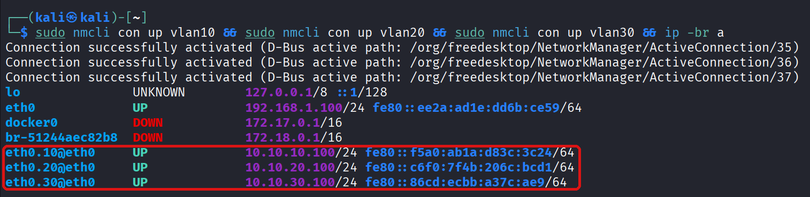

eth0 itself still has 192.168.1.100, because the untagged traffic on the trunk is the LAN.

## Step 7: Default deny before any rules

Before I made any firewall rules, I tried to ping the IOT gateway from the IOT interface:

```
ping -c 3 -I eth0.20 10.10.20.1
```

`-I eth0.20` means that ping must use the IOT interface, so the packet goes out with tag 20.

The result was 100% packet loss. This is the thing I wrote about in my first notes: new interfaces in pfSense block everything by default, and only LAN has an "allow all" rule from the start. So when you make a new zone, it is closed until you open it. That is the safe way to do it.

DHCP still worked in the step before, even with no rules. This is because pfSense makes hidden rules for DHCP by itself when the DHCP server is on for an interface.

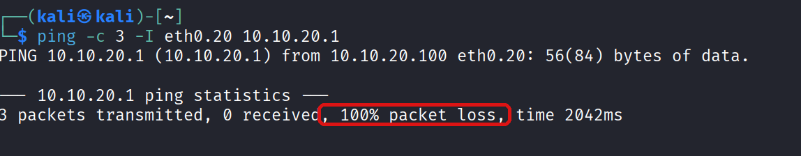

## Step 8: Alias for private networks

I want to block IOT and GUEST from all internal networks, not only from TRUSTED. The private address ranges are defined in RFC 1918:

| Range | Size |
|-------|------|
| 10.0.0.0/8 | 10.0.0.0 - 10.255.255.255 |
| 172.16.0.0/12 | 172.16.0.0 - 172.31.255.255 |
| 192.168.0.0/16 | 192.168.0.0 - 192.168.255.255 |

Under Firewall > Aliases I made an alias called `RFC1918` with these three ranges. An alias is like a variable. Then I can use one name in the rules instead of three rules, and if I add a new zone later (for example 10.10.40.0/24), it is already covered. The alias also covers the LAN (192.168.1.0/24) and the VMware network on WAN (192.168.170.0/24), so IOT and GUEST cannot reach those either.

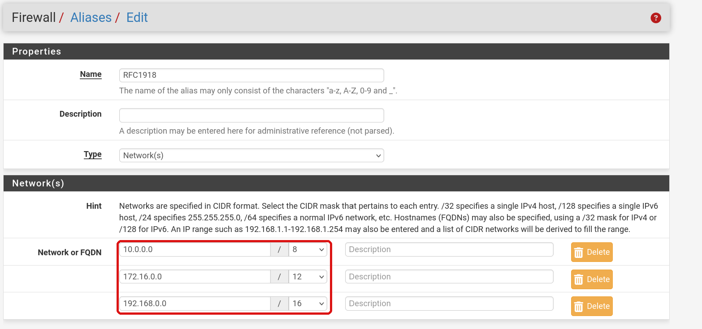

## Step 9: Firewall rules

Some things that are good to know about pfSense rules before you start:

- Rules are on the interface where the traffic comes in. A rule on the IOT tab is about traffic that starts in IOT.
- pfSense reads the rules from the top and down, and the first rule that matches wins. The rest are not checked.
- If no rule matches, the packet is blocked by the built in default deny.
- The firewall is stateful. If a connection is allowed, the answers are allowed back automatically.

So the order is very important. The block rules for internal networks must be above the rules that allow internet, because "any" also includes the internal networks.

This is how a rule looks when you make it. Here is the DNS rule for TRUSTED:

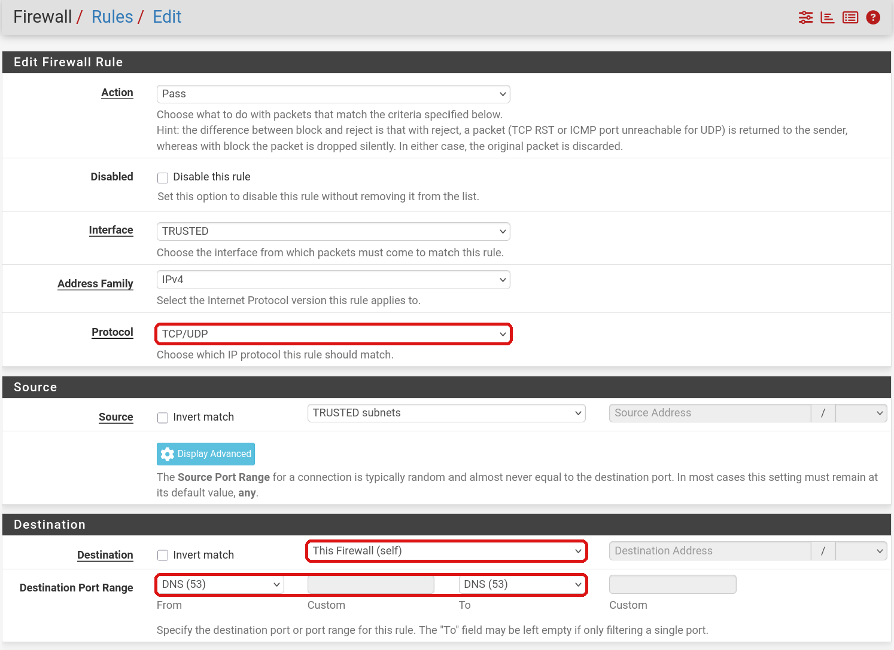

| Field | Value | Meaning |
|-------|-------|---------|
| Action | Pass | Let the traffic through. Block drops it quietly, Reject drops it and sends an error back. |
| Interface | TRUSTED | Traffic that comes in on the TRUSTED interface |
| Protocol | TCP/UDP | DNS uses UDP for normal lookups and TCP for big answers |
| Source | TRUSTED subnets | All addresses in 10.10.10.0/24 |
| Destination | This Firewall (self) | All of pfSense's own addresses |
| Destination port | DNS (53) | Only the DNS port |

I used Block and not Reject for the blocks. With Block, a scanner in IOT or GUEST does not even get an answer, so it has to wait for a timeout. That makes scanning slower and gives less information.

### TRUSTED

| # | Action | Protocol | Destination        | Port | Description          |
|---|--------|----------|--------------------|------|----------------------|
| 1 | Pass   | TCP      | This Firewall      | 53   | DNS til pfSense      |
| 2 | Pass   | TCP      | This Firewall      | 443  | Web-UI               |
| 3 | Pass   | any      | IOT subnets        | any  | Styre IoT fra TRUSTED|
| 4 | Block  | any      | GUEST subnets      | any  | Ikke mot gjester     |
| 5 | Pass   | any      | any                | any  | Internett            |

TRUSTED is the only of the three zones that can open the pfSense web interface (rule 2). It can reach IOT (rule 3), so I can control smart devices from my PC. It cannot reach GUEST (rule 4), because there is no reason my PC should talk to a guest phone. Rule 5 gives internet.

The marked rule is the block against guests. It has to be above rule 5, or rule 5 would let the traffic through first.

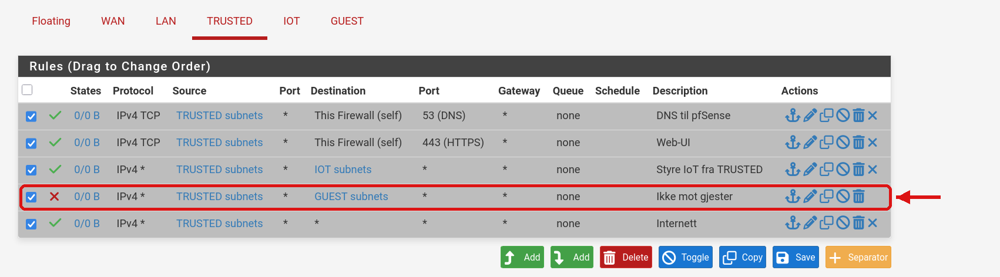

When I look at this screenshot now, rule 1 ended up as TCP only, but DNS mostly uses UDP. It still works, because rule 5 lets TRUSTED reach everything anyway. I should change it to TCP/UDP like on the other tabs.

### IOT

| # | Action | Protocol | Destination   | Port | Description                     |
|---|--------|----------|---------------|------|---------------------------------|
| 1 | Pass   | TCP/UDP  | This Firewall | 53   | DNS                             |
| 2 | Block  | any      | RFC1918       | any  | IOT skal ikke nå interne nett   |
| 3 | Pass   | TCP      | any           | 443  | Skytjenester                    |
| 4 | Pass   | UDP      | any           | 123  | NTP (time)                      |
| 5 | Block  | any      | any           | any  | Default deny                    |

IOT is the strictest zone. A smart device normally only needs three things:

1. DNS to find the address of its cloud service (rule 1)
2. HTTPS to talk to the cloud (rule 3)
3. NTP to get the right time (rule 4). Without the right time, HTTPS certificates can fail.

Everything else is blocked, also ping. Rule 1 must be above rule 2, because pfSense's own address (10.10.20.1) is also inside RFC1918, and then DNS would be blocked.

Rule 5 looks like the built in default deny, but I made my own because then I can turn on logging and give it a name. The two block rules (marked) have logging on, so I can see them in the firewall log.

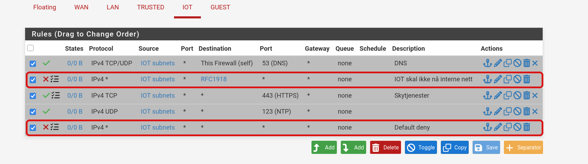

### GUEST

| # | Action | Protocol | Destination   | Port | Description        |
|---|--------|----------|---------------|------|--------------------|
| 1 | Pass   | TCP/UDP  | This Firewall | 53   | DNS                |
| 2 | Block  | any      | RFC1918       | any  | Ingen interne nett |
| 3 | Pass   | any      | any           | any  | Internett          |

Guests get full internet, but no internal networks at all. This is also why the web interface is safe from guests: 10.10.30.1 is inside RFC1918, so rule 2 blocks it.

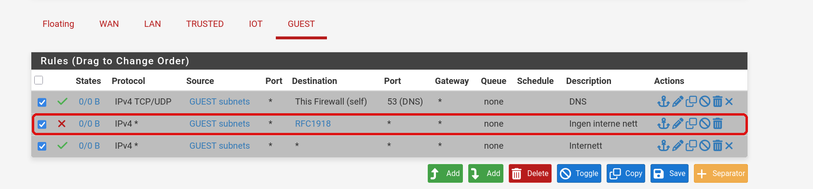

## Step 10: Testing the rules

Rules are only worth something if you test them. I tested two things for each zone: that the blocked traffic is really blocked, and that the allowed traffic still works.

There was one problem with testing from Kali. Kali has an address in all three zones at the same time. If I scan 10.10.10.1 from the GUEST interface, Linux sees that 10.10.10.0/24 is directly connected on eth0.10 and sends the packets out there. Then they never go through the GUEST rules. So for each test I took down vlan10 and made a route that sends TRUSTED traffic through the zone I want to test:

```
sudo nmcli con down vlan10
sudo ip route add 10.10.10.0/24 via 10.10.30.1 dev eth0.30
```

Now traffic to TRUSTED goes to the GUEST gateway first, and pfSense has to decide if it is allowed. I used pfSense's own TRUSTED address (10.10.10.1) as the target, as "a device in TRUSTED". It has a web server on 443, so there is something real to connect to.

### GUEST to TRUSTED

```
sudo nmap -Pn -e eth0.30 -p 22,80,443 10.10.10.1
```

| Flag | Meaning |
|------|---------|
| `-Pn` | Do not ping first, just scan. Ping is blocked, so nmap would think the host is down. |
| `-e eth0.30` | Send from the GUEST interface |
| `-p 22,80,443` | Only scan SSH, HTTP and HTTPS |

All ports are filtered. Filtered means nmap got no answer at all, which is what Block does.

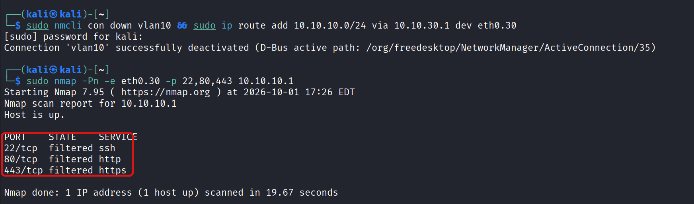

But this first scan was a bit too good. I found out later that I had not pressed Apply Changes on the GUEST rules, so at this time GUEST was blocked from everything, also the internet (see "Problems I hit"). After I pressed Apply, guests could ping the internet:

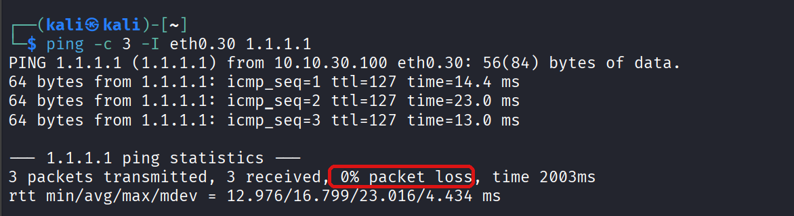

Then I ran the same nmap again, and the ports were still filtered. This time it is the rule "Ingen interne nett" that stops it, and not the default deny. It was also much faster (3 seconds instead of 19). I think this is because the first time nmap also had to wait for its DNS lookup, which was blocked too.

```
PORT    STATE    SERVICE
22/tcp  filtered ssh
80/tcp  filtered http
443/tcp filtered https

Nmap done: 1 IP address (1 host up) scanned in 3.12 seconds
```

### IOT

```
sudo ip route replace 10.10.10.0/24 via 10.10.20.1 dev eth0.20
curl -m 5 -k https://10.10.10.1 --interface eth0.20
curl -m 5 -sI https://example.com --interface eth0.20 | head -1
ping -c 3 -I eth0.20 1.1.1.1
```

`ip route replace` moves the test route from GUEST to IOT. `-m 5` makes curl give up after 5 seconds, `-k` accepts the self signed certificate on pfSense, and `-sI` only gets the headers so I can see the status code.

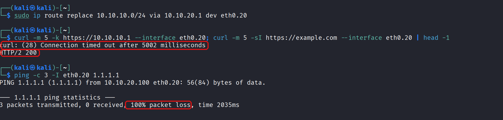

| Test | Result | Why |
|------|--------|-----|
| IOT to TRUSTED on 443 | timed out | blocked by "IOT skal ikke nå interne nett" |
| IOT to example.com on 443 | HTTP/2 200 | allowed by "Skytjenester". DNS works too, or curl could not find example.com |
| IOT ping to 1.1.1.1 | 100% packet loss | ICMP is not allowed, so "Default deny" stops it |

This is the result I wanted. The IOT zone gets what a smart device needs and nothing more. Even if a smart device in IOT gets hacked, it cannot scan or attack my own devices.

### Firewall log

Under Status > System Logs > Firewall you can see every logged packet and which rule handled it. A red cross is a block and a green check is a pass. If you hold the mouse over the cross, you see the rule.

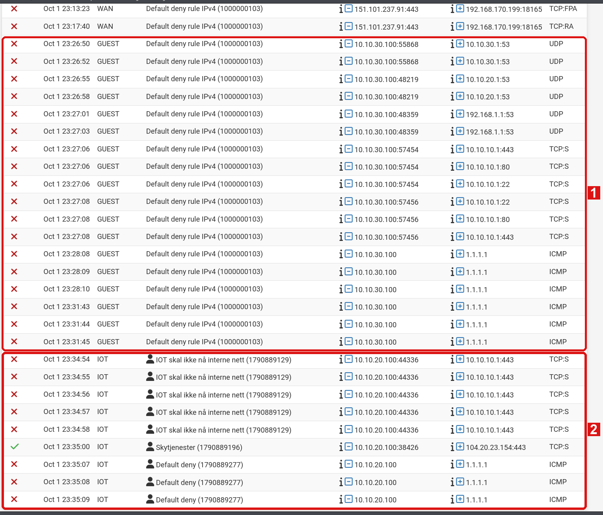

- Box 1 (GUEST, 23:26 to 23:31): everything from 10.10.30.100 is blocked by pfSense's built in "Default deny rule IPv4". DNS to the gateways, the nmap scan to 10.10.10.1 on port 22, 80 and 443, and the ping to 1.1.1.1. This was before I pressed Apply on the GUEST rules, and it is the proof of that problem.
- Box 2 (IOT, 23:34 to 23:35): here you can see my own rules working. The curl to 10.10.10.1:443 is blocked by "IOT skal ikke nå interne nett" (5 tries, because TCP sends the SYN again), the HTTPS to the internet is allowed by "Skytjenester" (green check), and the ping is blocked by my own "Default deny".

The GUEST block rule did not have logging turned on when I took this, so the second nmap from GUEST is not in the log.

When I was done testing I cleaned up in Kali:

```
sudo ip route del 10.10.10.0/24
sudo nmcli con up vlan10
```

## Problems I hit

These took longer than the setup itself, but I learned the most from them.

### 1. VLAN interfaces got no DHCP address

Kali made eth0.10, eth0.20 and eth0.30, but they only got IPv6 link-local addresses (fe80::) and `nmcli con up vlan10` timed out with "IP configuration could not be reserved".

I did not know if the problem was in Kali, in VMware or in pfSense, so I checked from one end to the other:

1. **Do the packets reach pfSense?** I ran a packet capture in pfSense (Diagnostics > Packet Capture) on the TRUSTED interface while Kali asked for an address. I could see `0.0.0.0.68 > 255.255.255.255.67`, which is a DHCP request. So the requests came in on VLAN 10, and the VLAN tagging in Kali and VMware was fine.
2. **Does pfSense answer?** No, there were no replies. The DHCP log said the server was only "Listening on BPF/em1/... 192.168.1.0/24". So the DHCP server did not listen on the VLANs at all, only on LAN.
3. **Is it the DHCP server?** I changed from ISC DHCP to Kea. Still no address.
4. **Does the interface really have an address?** In Diagnostics > Command Prompt I ran:

   ```
   ifconfig em1.10
   grep -A6 '"interfaces-config"' /usr/local/etc/kea/kea-dhcp4.conf
   sockstat -4l | grep kea
   ```

   The Kea config had em1.10 and the subnet 10.10.10.0/24, so the settings were saved. But `ifconfig em1.10` had no `inet 10.10.10.1` line, only IPv6 link-local. And `sockstat` showed that Kea only listened on 192.168.1.1:67. A DHCP server cannot listen on an interface with no IPv4 address. So the settings were saved, but never applied to the interface.

Fix: reboot pfSense (Apply Changes on each interface also works). After that all three VLANs got addresses right away.

What I learned: when pfSense says something is saved, it is not always active. `ifconfig` shows what is really running. And it helps a lot to go step by step from the client to the server instead of guessing.

### 2. GUEST rules did not work, but looked correct

GUEST could not ping 1.1.1.1, even with a Pass any rule. I checked step by step:

1. Ping from LAN (`ping -I eth0 1.1.1.1`) worked, so WAN and VMware NAT were fine.
2. `ip route` in Kali had `default via 10.10.30.1 dev eth0.30`, so Kali sent the traffic the right way.
3. `sudo tcpdump -ni eth0.30 icmp` only showed echo requests and no replies, so it was pfSense that stopped it.
4. The rules looked right, but the "States" column on the Internett rule was `0/0 B`. No traffic had ever matched it.

The reason was that I had not pressed Apply Changes. The rules were saved but not loaded into the firewall. After Apply, the ping worked.

What I learned: the States column is a quick way to see if a rule is actually used. And a test that blocks something is only useful if you also test that the allowed traffic still works. Otherwise you do not know which rule did the blocking.

### 3. Rule order was upside down

On IOT I first used the "Add" button with the arrow up, which puts the new rule at the top of the list. I added the rules in the right order, but each new one went above the last one, so the list ended up upside down. My "Default deny" was rule number 1 and blocked everything.

I dragged the rules into the right order and pressed Save. I also had NTP as TCP by mistake, but NTP uses UDP, so I fixed that too. Now I always use the "Add" button with the arrow down, which puts the rule at the bottom.

## What I learned

- **VLANs alone do not make the network safer.** They only put devices in different groups. It is the firewall rules between the zones that decide what can talk to what.
- **The order of the rules matters as much as the rules.** First match wins, so the specific blocks must be above the wide allows.
- **Start closed and open only what you need.** pfSense does this by itself for new interfaces, and I did the same with my own default deny on IOT.
- **Saved is not the same as active.** Both of my biggest problems were settings that were saved but not applied.
- **Test both sides.** My first nmap test looked perfect, but it was only perfect because everything was broken.
- **Logs show what really happened.** The firewall log showed exactly which rule handled each packet, and it proved both the problem and the fix.

## Not in this version

- WireGuard. It was part of the earlier version (see `notes/wireguard.md`), but it is not set up in this one yet.
- A physical access point. The earlier version used an ASUS router as an access point. Now everything is virtual.

## Next steps

From `TODO.md`:

- Suricata for traffic inspection
- A syslog server that gets the pfSense logs, so they are not only stored on the firewall
- Automatic backup of the pfSense config
- Pi-hole or DNS filtering for TRUSTED

## More notes

- `ip-plan.md`: IP plan from the earlier version
- `notes/brannmurregler.md`: firewall rules from the earlier version
- `notes/feilsøking.md`: problems from the earlier version
- `notes/wireguard.md`: WireGuard setup from the earlier version
- `TODO.md`: things I want to add later
